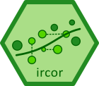

[](https://travis-ci.org/julian-urbano/ircor)
[](https://opensource.org/licenses/MIT)
[](https://cran.r-project.org/package=ircor) 
[](https://cran.r-project.org/package=ircor) 

# ircor 

Provides implementation of various correlation coefficients of common use in Information Retrieval, such as Kendall and AP correlation coefficients, with and without ties.

For reference please refer to *Julián Urbano and Mónica Marrero, "[The Treatment of Ties in AP Correlation](http://julian-urbano.info/files/publications/072-treatment-ties-ap-correlation.pdf)", ACM ICTIR, 2017*.

## Installation

You may install the stable release from CRAN

```r
install.packages("ircor")
```

or the latest development version from GitHub

```r
devtools::install_github("julian-urbano/ircor", ref = "develop")
```

## Usage

`tau` and `tauAP` implement the Kendall tau and Yilmaz tauAP correlation coefficients, where no ties are allowed between items:

```r
x <- c(0.06, 0.2, 0.27, 0.37, 0.57, 0.63, 0.66, 0.9, 0.91, 0.94)
y <- c(0.37, 0.06, 0.2, 0.27, 0.57, 0.66, 0.63, 0.91, 0.9, 0.94)
tau(x,y)
# 0.7777778
tauAP(x,y)
# 0.7491182
```
In `tauAP` it is important to use the correct sorting order. By default, items are sorted in decreasing order, as should be for instance if the scores represent system effectiveness. When they should be sorted in increasing order, `decreasing` should be set to `FALSE`:

```r
# these two calls are equivalent
tauAP(x,y)
# 0.7491182
tauAP(-x,-y, decreasing = FALSE)
# 0.7491182
```

`tau_a` and `tauAP_a` are versions to use when `x` represents a true ranking without ties, and `y` represents a ranking estimated by an observer who is allowed to produce ties. They can be used as a measure of *accuracy* of the observer with respect to the true ranking.

```r
y <- round(y*5)/5 # simulate ties in y
tau_a(x,y)
# 0.7111111
tauAP_a(x,y)
# 0.6074515
```
`tau_b` and `tauAP_b` are versions to use under the assumption that both `x` and `y` represent rankings estimated by two observers who may produce ties. They can be used as a measure of *agreement* between the observers:

```r
x <- round(x*5)/5 # simulate ties in x as well
tau_b(x,y)
# 0.75
tauAP_b(x,y)
# 0.6269841
```

## ircor in Python

A Python implementation by Jaehun Kim is available [here](https://github.com/eldrin/pyircor).

## License

`ircor` is released under the terms of the [MIT License](https://opensource.org/licenses/MIT).

If you use this code in your work, please cite the following paper:

```latex
@inproceedings{urbano2017ties,
  author = {Urbano, Juli{\'{a}}n and Marrero, M{\'{o}}nica},
  booktitle = {ACM SIGIR International Conference on the Theory of Information Retrieval},
  pages = {321--324},
  title = {{The Treatment of Ties in AP Correlation}},
  year = {2017}
}

```
